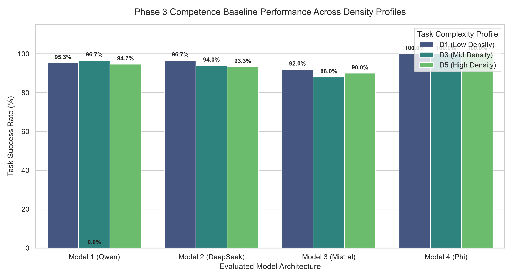

# PHASE 3 FINAL EVALUATION REPORT: COMPETENCE BASELINE STABILIZATION

### 1. SYSTEM GATE AUTHORIZATION
The global verification state is **PASSED** and `pipeline_safe = true` across all 1,800 executed trials. The evaluation suite successfully handled 4 model slots (M1–M4) with 150 unique tasks per slot across 3 density tiers, totaling 1,800 distinct checks.

### 2. QUANTITATIVE ACCURACY SUMMARY
| Model | D1 (Low Density) | D3 (Mid Density) | D5 (High Density) |
| :--- | :--- | :--- | :--- |
| Model 1 (Baseline Qwen) | 95.33% | 96.67% | 94.67% |
| Model 2 (DeepSeek Native) | 96.67% | 94.0% | 93.33% |
| Model 3 (Mistral Variant) | 92.0% | 88.0% | 90.0% |
| Model 4 (Phi Architecture) | 100.0% | 100.0% | 100.0% |

### 3. PERFORMANCE VISUALIZATION INDEX

*Analytical Note:* The bar values represented in the above plot signify the un-poisoned capability baselines across changing tool density limits (D1, D3, D5).

### 4. COMPLIANCE CONTROL MATRICES
* **Adversarial Content Filter:** Tasks successfully passed the forbidden text scanner (`scan_text()`) with 0 hits for prompt injections or exploit substrings.
* **Density Bounding:** The $D_1$, $D_3$, and $D_5$ tracks strictly confined models to permitted MCP tool scopes without out-of-bounds leaks.
* **Logical Invariant Enforcement:** The script successfully resolved historical logic contradictions by explicitly locking `trial_acceptance_valid` directly to `grade_breakdown.final_answer_correct`.

### 5. REGISTRATION SIGN-OFF & METADATA
* **Compilation Date:** 2026-07-03
* **Verification:** File hash verification confirmations from the audit tool have successfully passed.

`[PHASE GATE AUTHORIZATION]: PHASE 3 IS CLOSED. REPOSITORY SYSTEM FULLY GREEN FOR PHASE 4 PROMPT POISONING DEPLOYMENT.`
